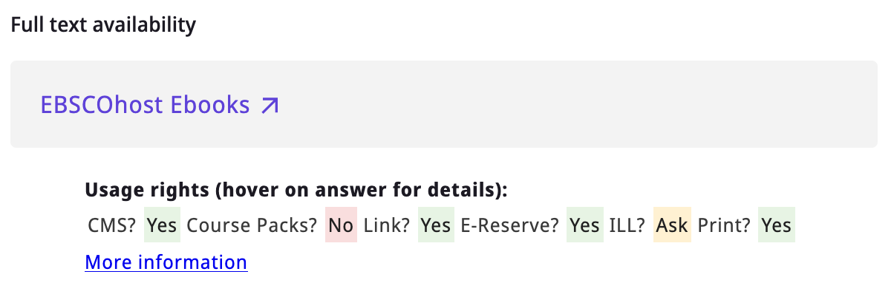
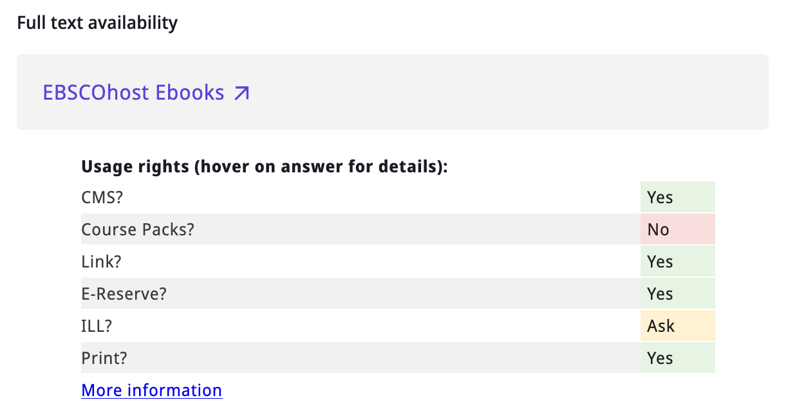
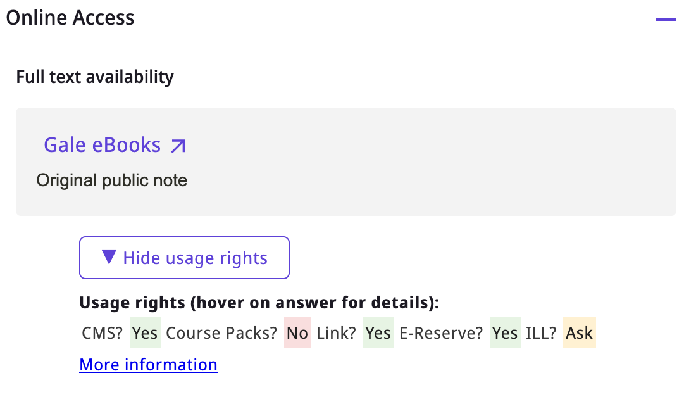
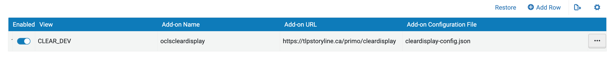

# Display CLEAR/OUR permitted uses in Primo (NDE Add-On)

**This repository contains the NDE Add-on version of the CLEAR display module. For Primo VE,
[use the older version here](https://github.com/oclservice/ocls-clear-display).**

This module dynamically replaces hyperlinks to permitted uses records managed by
the [OCUL Usage Rights (OUR) service](https://learn.scholarsportal.info/all-guides/our/)
(rebranded as CLEAR for Ontario colleges) with a visual summary.

Once enabled, permitted uses information pulled from CLEAR/OUR are displayed underneath each View It item:



Alternatively, you can opt for a more verbose display of permitted uses (set `compact_display` to `false` below):



You can also choose between always displaying image rights or using a button to toggle visibility on and off (see `toggle_display` in settings below):



## How it works

This module works by identifying links to CLEAR/OUR records provided in the Public Note for a collection. More specifically,
it is looking for URLs with the format 

```
https://<clear|ocul>.scholarsportal.info/<institution>/<product>
```

For each link
like this, the module then sends a request to the CLEAR/OUR API for that record and displays the response visually on Primo.

## How to enable the add-on

### Step 1: Download and customize settings file

Download the [`cleardisplay-config.json` config file](add-on-config/cleardisplay-config.json) and save it to your computer.

Edit the config file according to your needs:

Property | Effect
---------|-------
`compact_display` | Set this to `true` to display a compact version of the usage rights. Short text for each individual permission is set in the `terms` object (see below).
`hover_text` | Set this to `true` to add a hover effect with the full response text over the brief response. When using the `compact_display` setting, this also adds the full question text over the user defined short text.
`toggle_display`| This object defines whether to display a button to toggle visibility of usage rights on/off.
`∟ enable` | Set this to `true` to enable the toggle button behaviour.
`∟ show` | Text to display on the toggle button to show usage rights.
`∟ hide` | Text to display on the toggle button to hide usage rights.
`title_text` | Defines what text is to be displayed above the permitted uses table. This value can contain basic HTML tags to control appearance.
`footer_text` | Defines what text is to be displayed underneath the permitted uses table. When `display_in_note` is not enabled, this text is wrapped with a hyperlink to the full CLEAR/OUR record.
`local_instance` | This value can be set to a custom OUR instance name to **override** the one in the original URL. See note below regarding CLEAR Local override.
`terms` | A dictionary of objects for each permission term supplied by CLEAR/OUR. For each term, you can define the following two properties:
`∟ short_text`| Set this value to the short text you want to display when using the `compact_display` mode (see above).
`∟ hide` | Set this to true if you want to hide a particular term from the display.

### Step 2: Load the add-on

Log-in to your Alma back-end and navigate to **Configuration > Discovery > Other > Add-on Configuration**.

Select **Add row** and fill in the fields as follows:

* Activate Add-on: check this box
* Add-on Name: `oclscleardisplay`
* Add-on Configuration File: select and upload the config file you edited in the previous step.
* View: Choose for which view(s) you want to enable the add-on, or **All**. This will only work on NDE views.
* Add-on URL: paste here the add-on URL (provided by OCLS)

Click save and make sure the add-on is enabled on the list:



Refer to the [Exlibris official add-on documentation](https://knowledge.exlibrisgroup.com/Primo/Product_Documentation/020Primo_VE/Primo_VE_(English)/120Other_Configurations/Managing_Add-Ons_for_the_NDE_UI)
for more information.

## CLEAR Local override

In the case of the Ontario colleges, CLEAR URLs are provided by OCLS for all consortial resources. Colleges who have opted to use the CLEAR Local service,
can in addition manage their own CLEAR instance and add their own URLs to local resources in their Institution Zone. However, the URLs provided by OCLS on
consortial resources will retrieve CLEAR Central records for those resources, while CLEAR Local colleges may want their own records to be displayed instead.

This can be achieved by setting the `local_instance` variable in the configuration array to the name of their instance. Setting this variable will
**override** the instance name in **all** CLEAR links found by the module, falling back to the linked instance if unsuccessful.

In other words, if a CLEAR Local record exists, it will be displayed instead of the CLEAR Central record. If no CLEAR Local record exists for that resource,
the CLEAR Central record will be used instead.


## Add-on development

The code in this repository builds on the [Primo NDE customModule](https://github.com/ExLibrisGroup/customModule) functionality from ExLibris, where more information
on development can be found.

To update the add-on after code changes:

#### 1. Install necessary npm packages

If not done before, inside the `customModule` directory run

```
npm install
```

#### 2. Make sure `buildsettings.env`    contains the following

```
INST_ID=OCLS
VIEW_ID=CLEARDISPLAY
ADDON_NAME=oclscleardisplay
```

#### 3. Build the add-on

Inside the `customModule` directory, run

```
npm run build
```

This will generate a new directory named `OCLS-CLEARDISPLAY` inside the `dist` directory.

#### 4. Deploy the add-on

Copy the contents of `OCLS-CLEARDISPLAY` into the directory used for deployment. Be sure to **replace** all existing contents.

Changes will immediately be applied to all colleges that have enabled the add-on. Test to make sure changes were successful.

Refer to the [Primo NDE customModule](https://github.com/ExLibrisGroup/customModule) repository for more information on NDE add-on development.

## A note on accessibility

The colours of the text and background for the "Yes/No/Ask" boxes in the provided CSS were chosen to have a contrast ratio
of at least 4.5:1 as per [WCAG 2.0](https://www.w3.org/WAI/WCAG21/quickref/?versions=2.0#contrast-minimum):

* "Yes": #212121 on #e7f4e4 (contrast ratio 14.2:1)
* "No": #212121 on #f9dede (contrast ratio 12.7:1)
* "Ask": #212121 on #fff1d2 (contrast ratio 14.4:1)

These colour values come from the [Carnegie Museum of Pittsburgh Web Accessibility Guidelines colour palette](http://web-accessibility.carnegiemuseums.org/design/color/).

